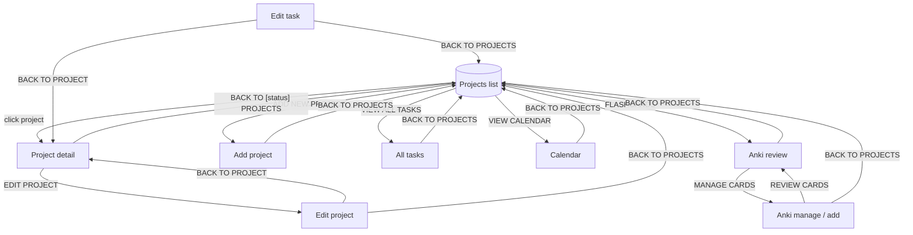

Just creating a mermaid chart to ensure navigation possible between templates:

```mermaid
graph TD
    Projects[(Projects list)]
    ProjectDetail[Project detail]
    AddProject[Add project]
    EditProject[Edit project]
    EditTask[Edit task]
    Tasks[All tasks]
    Calendar[Calendar]
    AnkiReview[Anki review]
    AnkiManage[Anki manage / add]

    Projects -->|click project| ProjectDetail
    Projects -->|ADD NEW PROJECT| AddProject
    Projects -->|VIEW ALL TASKS| Tasks
    Projects -->|FLASHCARDS| AnkiReview
    Projects -->|VIEW CALENDAR| Calendar

    ProjectDetail -->|EDIT PROJECT| EditProject
    ProjectDetail -->|"BACK TO [status] PROJECTS"| Projects

    AddProject -->|BACK TO PROJECTS| Projects

    EditProject -->|BACK TO PROJECT| ProjectDetail
    EditProject -->|BACK TO PROJECTS| Projects

    EditTask -->|BACK TO PROJECT| ProjectDetail
    EditTask -->|BACK TO PROJECTS| Projects

    Tasks -->|BACK TO PROJECTS| Projects

    Calendar -->|BACK TO PROJECTS| Projects

    AnkiReview -->|MANAGE CARDS| AnkiManage
    AnkiReview -->|BACK TO PROJECTS| Projects
    AnkiManage -->|REVIEW CARDS| AnkiReview
    AnkiManage -->|BACK TO PROJECTS| Projects
```
